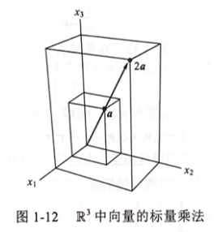
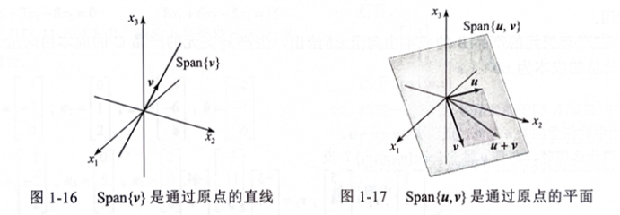
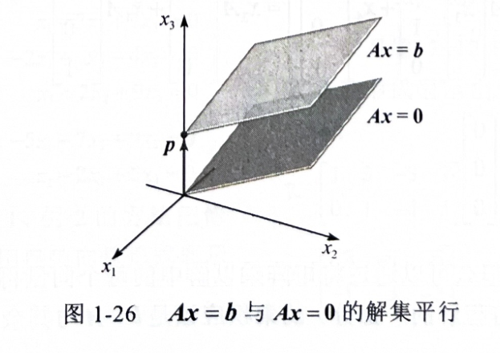
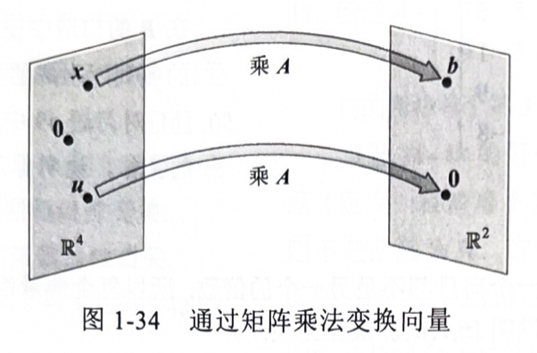
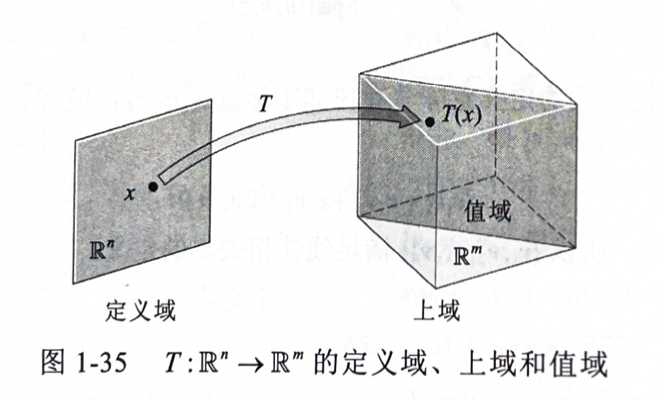
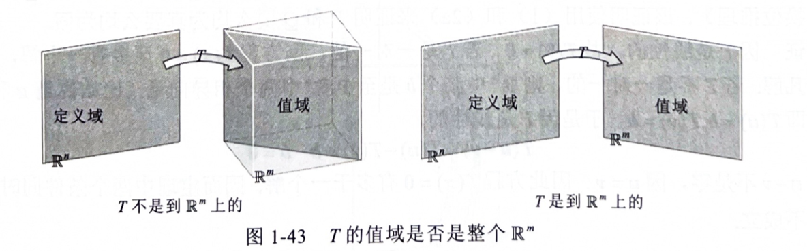
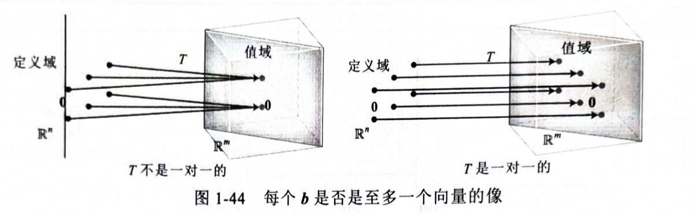

# 线性代数中的线性方程组

## 1.1 线性方程组
- 定义：形如$a_{1}x_{1}+a_{2}x_{2}+...+a_{n}x_{n}=b$，其中b与系数$a_{1},a_{2},...,a_{n}$是实数或复数，通常是已知数，下标n为任意**正整数**。

### 线性方程组的解

 线性方程组的解有下列三种情况： 
    1. 无解 
    2. 有唯一解 
    3. 有无穷多解

  我们称一个线性方程组是相容的，若它有一个解或无究多解；称它是不相容的，若它无解。

### 初等行变换

  <strong>初等行变换</strong>
  
  1. 倍加变换：把某一行换成它本身与另一行的倍数的和  
  2. 对换变换：把两行对换  
  3. 倍乘变换：把某一行的所有元素乘以同一个非零数

### 重要定理

若两个线性方程组的增广矩阵是行等价的，则它们具有相同的解集**

### 基本问题

  线性方程组的两个基本问题
  
  1. 方程组是否相容，即它是否至少有一个解？
  2. 若它有解，它是否只有一个解，即解是否唯一？

### 示例
考虑以下线性方程组：
$$
\begin{cases}
2x + y = 4 \\
x - y = 1
\end{cases}
$$

## 1.2 行化简与阶梯形矩阵
### 定义 一个矩阵称为**阶梯形（或行阶梯形）**，若它有以下三个性质：
    1. 所有非零行都在零行之上
    2. 每一行的先导元素所在的列位于前一行先导元素的右边
    3. 先导元素所在列下方的元素都是零
    若一个阶梯形矩阵还满足以下性质，则称它为**简化阶梯形（或简化行阶梯形）**：
    4. 非零行的先导元素是1
    5. 先导元素1是该元素所在列的唯一非零元素
    若一个矩阵具有阶梯形（简化阶梯形），就称它为**阶梯形（简化阶梯形）**矩阵。性质2说明先导元素构成阶梯形。性质3其实是性质2的推论。

### 定理1（简化阶梯形矩阵的唯一性）
    每个矩阵行等价于唯一的简化阶梯形矩阵

### 主元位置
    定义 矩阵中的**主元位置**是*A*中对应于它的简化阶梯形中先导元素1的位置。主元列是*A*的含有主元位置的列。

### 行化简算法
    下列算法包含四个步骤，产生一个阶梯形矩阵，第五步产生简化阶梯形矩阵：
    第1步：由最左的非零列开始，这是一个主元列，主元位置在该列顶端
    第2步：在主元列中选取一个非零元素作为主元，若有必要的话，对换两行将这个元素移到主元位置上。
    第3步：用倍加行变换将主元下面的元素变成0.
    第4步：暂时不管包含主元位置的行以及它上面的各行，对剩下的子矩阵使用上述的三个步骤直到没有非零行需要处理为止。
    第5步：由最右边的主元开始，把每个主元上方的各元素变成0， 若某个主元不是1，用倍乘变换将它变成1.
  
### 线性方程组的解
 $$
 \begin{bmatrix}
    1 & 0 & -5 & 1 \\
    0 & 1 & 1 & 4 \\
    0 & 0 & 0 & 0 \\
 \end{bmatrix}
 $$
    因为增广矩阵有4列，所以有3个变量，对应的线性方程组是：
$$
\begin{align}
\begin{cases}
\nonumber
       x_1    -5x_3 = 1 \\
       x_2 + x_3 = 4 \\
       0 = 0 \\
\end{cases}
&\Rightarrow
\begin{cases}
x_1 = 1 + 5x_3 \\
x_2 = 4 - x_3 \\
x_3\text{是自由变量}
\end{cases}
\end{align}
$$
    对应于主元列的变量$x_{1}$和$x_{2}$称为**基本变量**，其它变量（如$x_{3}$)称为**自由变量**，后面给出的解称为方程的**通解**。
### 解集的参数表示
$$
\begin{cases}
x_1 = 1 + 5x_3 \\
x_2 = 4 - x_3  \\
x_3是自由变量 \\
\end{cases}
$$

### 存在性与唯一性问题
定理2 （存在性与唯一性定理）
线性方程组相容的充要条件是增广矩阵的最右列不是主元列。也就是说，增广矩阵的阶梯形没有形如：
$$
\begin{bmatrix}
0 &... &0 &b \\
\end{bmatrix}
$$
的行，若线性方程组相容，则它的解集可能有两种情况：(i)没有自由变量时，有唯一解；(ii)若至少有一个自由变量，则有无究多解。
### 应用行化简算法解线性方程组

1. 写出方程组的增广矩阵 
2. 应用行化简算法把增广矩阵化为阶梯形，确定方程组是否相容，如果没有解则停止；否则进行下一步 
3. 继续行化简算法得到它的简化阶梯形 
4. 写出由第3步所得矩阵对应的方程组 
5. 把第4步所得的每个非零方程改写为用任意自由亦是表示其基本变量的形式 

## 向量方程
### $\mathbb{R}^n$向量空间
    仅含一列的矩阵称为列向量，或简称向量。包含两个元素的向量如下所示：
   $u = \begin{bmatrix}3 \\ -1 \end{bmatrix}$, $v = \begin{bmatrix}0.2 \\ 0.3 \end{bmatrix}$, $w = \begin{bmatrix}w_1 \\ w_2 \end{bmatrix}$
   其中，$w_1$和$w_2$是任意实数。所有两个元素的向量的集记为$\mathbb{R}^2$，$\mathbb{R}$表示向量中的元素是实数，而指数2表示每个向量有两个元素。
   - 向量的加法:两个向量中对应元素相加 $u + v$
   - 标量乘法:向量中的每个元素乘以一个数, $cu$，其中$c$是一个实数

### $\mathbb{R}^2$的几何表示
   考虑平面上的直角坐标系，因为平面上的每个点由实数的有序对确定，所以可把几何点$(a,b)$与列向量$\begin{bmatrix}a \\ b \end{bmatrix}$等同，因此我们可把$\mathbb{R}^2$中的向量表示为平面上的点，见下图：
   
   
### 向量加法的平行四边形法则
  设$u,v,w$是$\mathbb{R}^2$中的向量，若$u+v = w$，则$u$与$v$平行，且$u$与$w$的长度相等。
  

### $\mathbb{R}^3$中的向量
 $\mathbb{R}^3$中的向量是3x1矩阵，有3个元素，它们表示三维坐标空间中的点，或起点为原点的箭头，如：
 $$
 a = \begin{bmatrix}
    2 \\
    3 \\
    4
 \end{bmatrix}
 $$ 
 下图表给出了向量$a$及$2a$的几何表示：
 

### $\mathbb{R}^n$中的向量
 若n是任意正整数，则$\mathbb{R}^n$表示所有n个实数（或有序n元组）的集合，通常写成$n\times1$列矩阵的形式，如：
 $$
 u = \begin{bmatrix}
 u_1 \\
 u_2 \\
 \vdots \\
 u_n \\
 \end{bmatrix}
 $$
 所有元素都是零的向量称为零向量，用$0$表示。

 ### $\mathbb{R}^n$向量的代数性质
 对$\mathbb{R}^n$中的一切向量$u,v,w$以及标量$c$和$d$:
 1. $u+v = v+u$
 2. $u+(v+w) = (u+v)+w$
 3. $u+0=0+u = u$
 4. $u+(-u) = -u+u=0$
 5. $(c+d)u = cu + du$
 6. $c(u+v) = cu + cv$
 7. $c(du) = (cd)u$
 8. $1u = u$

### 线性组合
   给定$\mathbb{R}^n$中的向量$v_1,v_2,...,v_p$和标量$c_1,c_2,...,c_p$，向量：
   $$
   y=c_1v_1+c_2v_2+...+c_pv_p
   $$
   称为向量$v_1,v_2,...,v_p$以$c_1,c_2,...,c_p$为权的线性组合。线性组合中的权可为任意实数，包括零。例如，下列向量都是向量$v_1和v_2$的线性组合：
   $$
   \sqrt{2}v_1+v_2,\space3v_1-2v_2 \\
  \frac{1}{2}v_1+\frac{1}{2}v_2,\space0v_1+1v_2 \\
   $$
   零向量是所有向量的线性组合，即：
   $$
   0 = 0v_1+0v_2+...+0v_p
   $$ 
  结论：
  向量方程
  $$
  x_1a_1+x_2a_2+...+x_na_n = b
  $$
  和增广矩阵
  $$
  \begin{bmatrix}
    a_1 & a_2 & \cdots & a_n & b \\
  \end{bmatrix}
  $$
  的线性方程组有相同的解集。特别地，$b$可表示为$a_1,a_2,...,a_n$的线性组合当且仅当对应于增广矩阵的线性方程组有解。
  线性代数的一个主要思想是研究可以表示为某一固定向量集合$\{v_1,v_2,...,v_p\}$的线性组合的所有向量。
  定义  若$v_1,v_2,...,v_p$是$\mathbb{R}^n$中的向量，则$v_1,v_2,...,v_p$的所有线性组合所成的集合用记号$Span\{v_1,v_2,...,v_p\}$表示，称为向量$v_1,v_2,...,v_p$所生成（或张成）的$\mathbb{R}^n$**子集**。也就是说，$Span\{v_1,v_2,...,v_p\}$是所有形如：
  $$
  c_1v_1+c_2v_2+...+c_pv_p 
  $$ 
  的向量的集合，其中$c_1,c_2,...,c_p$为标量。

### $Span\{v\}$与$Span\{u, v\}$的几何解释
下图给出了张成空间的几何解释：

## 1.4 矩阵方程 $Ax=b$
  ### 定义  若$A$是$m\times n$矩阵，它的列为$a_1, a_2, ..., a_n$, 若$x$是$\mathbb{R}^n$中的向量，则积$Ax$定义为向量：
  $$
  Ax = \begin{bmatrix}
  a_1 & a_2 & \cdots & a_n
  \end{bmatrix}
  \begin{bmatrix}
  x_1 \\ x_2 \\ \vdots \\ x_n
  \end{bmatrix} = x_1a_1 + x_2a_2 + \cdots + x_na_n
  $$
  就是$A$的各列以x中对应元素为权的线性组合，注意$Ax$仅当$A$的列数等于$x$中的元素个数时才有定义。  

  ### 定理3  若$A$是$m\times n$矩阵，它的列为$a_1, a_2, ..., a_n$, 而$b$属于$\mathbb{R}^m$，则矩阵方程
  $$
  Ax=b
  $$
  与列向量方程
  $$
  x_1a_1+x_2a_2+...+x_na_n = b
  $$
  有相同的解集，它又与增广矩阵为
  $$
  \begin{bmatrix}
  a_1 & a_2 & a_3 & \cdots & a_n &b
  \end{bmatrix}
  $$
  的线性方程组有相同的解集。

  ### 解的存在性
  $Ax$的定义直接导致下列有用的事实：
  方程$Ax=b$有解当且仅当$b$是$A$的各列的线性组合

  ### 定理4 设$A$是$m\times n$矩阵，则下列命题是逻辑上等价的，也就是说，对某个$A$，它们都成立或者都不成立：
  a. 对$\mathbb{R}^m$中的每个b，方程$Ax=b$有解
  b. $\mathbb{R}^m$中的每个b都是$A$的列的一个线性组合
  c. $A$的各列生成$\mathbb{R}^m$
  d. $A$的每一行都有一个主元位置

  **警告**  定理4讨论的是系数矩阵，而非增广矩阵，若增广矩阵$\begin{bmatrix}A&b\end{bmatrix}$在每一行都有一个主元位置，那么方程$Ax=b$可能相容，也可能不相容。

计算Ax的行-向量规则
若乘积Ax有定义，则Ax的第i行元素是A的第i行与x的相应元素的乘积之和。

### 矩阵-向量积$Ax$的性质
定理5 设$A$是$m\times n$矩阵，$u$和$v$是$\mathbb{R}^n$中的向量，$c$是标量，则
a. $A(u+v)=Au+Av$
b. $A(cu) = c(Au)$

## 1.5 线性方程组的解集
### 齐次线性方程组
  线性方程组称为齐次的，若它可写成$Ax$=0的形式，其中$A$是$m\times n$矩阵，0是$\mathbb{R}^n$中的零向量，这样的方程组至少有一个解，即$x=0$(0是$\mathbb{R}^n$中的零向量)，这个解称为它的平凡解。对给定方程$Ax=0$，重要的是它是否有非平凡解，即满足$Ax=0$的非零向量$x$。由1.2节解的存在性与唯一性定理（定理2）得出以下事实：
  齐次方程$Ax=0$有非平凡解当方程至少有一个自由变量。
  例1 确定下列方程组是否有非平凡解，并描述它的解集：
$$
\begin{align}
\begin{cases}
\nonumber
       3x_1+5x_2-4x_3 = 0 \\
       -3x_1-2x_2+4x_3 = 0 \\
       6x_1+x_2-8x_3 = 0 \\
\end{cases}
&\Rightarrow
\begin{bmatrix}
3 & 5 & -4 & 0 \\
-3 & -2 & 4 & 0\\
6 & 1 & -8 & 0\\
\end{bmatrix}
&\Rightarrow
\begin{bmatrix}
1 & 0 & -4/3 & 0\\
0 & 1 & 0 & 0 \\
0 & 0 & 0 & 0\\
\end{bmatrix}
&\Rightarrow
\begin{cases}
x_1 - 4/3x_3 = 0 \\
x_2 = 0 \\
0 = 0
\end{cases}
\end{align}
$$
$x = \begin{bmatrix}x_1 \\ x_2 \\ x_3 \end{bmatrix} = \begin{bmatrix}\frac{4}{3}x_3 \\ 0 \\ x_3 \end{bmatrix}=x_3\begin{bmatrix}\frac{4}{3} \\ 0 \\ 1 \end{bmatrix}=x_3v$, 其中$v$是$\mathbb{R}^3$中的向量，$v = \begin{bmatrix}\frac{4}{3} \\ 0 \\ 1 \end{bmatrix}$

例2 单一方程也可看作简单的方程组，描述下列齐次“方程组”的解集：
$10x_1-3x_2-2x_3=0$
通解为：$x_1=0.3x_2+0.2x_3$
$x_2$和$x_3$为自由变量，写成向量方式：
$x = \begin{bmatrix}x_1 \\ x_2 \\ x_3 \end{bmatrix} = \begin{bmatrix}0.3x_2+0.2x_3 \\ x_2 \\ x_3 \end{bmatrix} = x_2\begin{bmatrix}0.3 \\ 1 \\ 0 \end{bmatrix}+x_3\begin{bmatrix}0.2 \\ 0 \\ 1 \end{bmatrix}$

以上的例子说明齐次方程$Ax=0$总可表示为$Span\{v_1,v_2,...,v_p\}$的形式，其中$v_1,v_2,...,v_p$是适当的解向量，若唯一解是零向量，则解集就是$Span\{0\}$

### 参数向量形式
$x=su+tv$，其中$s$和$t$是任意实数，$u$和$v$是$\mathbb{R}^n$中的向量，称为参数向量形式。

### 非齐次线性方程组的解
定理6 设方程$Ax=b$对某个$b$是相容的，$p$为一个特解，则$Ax=b$的解集是所有形如$w=p+v_h$的向量的集合，其中$v_h$是齐次方程$Ax=0$的任意一个解。

定理6说明若$Ax=b$有解，则解集可由$Ax=0$的解集平移向量$p$得到，其中$p$是$Ax=b$的任意一个特解。下图说明了当有两个自由变量时的情形：

警告  定理6与图1-26仅适用于方程$Ax-b$至少有一个非零解$p$的前提下。当$Ax=b$无解时，解集为空集。

把（相容方程组）解集表示成参数向量形式： 
1.把增广矩阵行简化为简化阶梯形 
2.把每个基本变量用自由变量表示 
3.把一般解$x$表示成向量，如果有自由变量，其元素依赖于自由变量 
4.把x分解为向量（元素为常数）的线性组合，用自由变量作为参数 

例3 描述$Ax=b$的解，其中：
$$
A =
\begin{bmatrix}
3 & 5 & -4 \\
-3 & -2 & 4 \\
6 & 1 & -8 \\
\end{bmatrix}, b = \begin{bmatrix}7 \\ -1 \\ 7 \\ \end{bmatrix}
$$
通解写成向量形式：
$$
x = \begin{bmatrix}x_1 \\ x_2 \\ x_3 \end{bmatrix} = \begin{bmatrix}-1+\frac{4}{3}x_3 \\ 2 \\ x_3 \end{bmatrix} = \begin{bmatrix}-1 \\ 2 \\ 0 \end{bmatrix}+x_3\begin{bmatrix}\frac{4}{3} \\ 0 \\ 1 \end{bmatrix}
$$
方程$x=p+x_3v$，其中$p$是特解，$v$是齐次方程$Ax=0$的一个特解, 几何上$Ax=0$的解集被平移$p$得到。

## 线性方程组的应用
* 经济学中的齐次线性方程组
* 配平化学方程式
* 网络流

## 1.7 向量的线性相关性
### 定义 $\mathbb{R}^n$中一组向量$\{v_1,v_2,...,v_p\}$称为线性无关的，若向量方程：
$$
c_1v_1+c_2v_2+...+c_pv_p = 0
$$
仅有平凡解。向量组（集）$\{v_1,v_2,...,v_p\}$称为线性相关的，若存在不全为零的权$c_1,c_2,...,c_p$，使得：
$$
c_1v_1+c_2v_2+...+c_pv_p = 0
$$
则上面的方程称为向量$v_1,v_2,...,v_p$的线性相关关系。

###  矩阵各列的线性相关性
设我们不考虑向量组而是考虑矩阵$A=[a_1,a_2,...,a_n]$，则矩阵$Ax=0$可以写成
$$
x_1a_1+x_2a_2+...+x_na_n = 0
$$
$A$的各列之间的每一个线性相关关系对应于方程$Ax=0$的一个非平凡解。因此我们有下列重要事实：
矩阵$A$的各列线性无关，当且仅当方程$Ax=0$仅有平凡解

两个向量的集合\begin{bmatrix}v_1,v_2\end{bmatrix}线性相关，当且仅当其中一个向量是另一个向量的倍数。这个集合线性无关，当且仅当其中任一个向量都不是另一个向量的倍数。

### 定理7 （线性相关集的特征）
两个或更多个向量的集合$S=\begin{bmatrix}v_1,v_2,...,v_p\end{bmatrix}$线性相关，当且仅当$S$中至少有一个向量是其他向量的线性组合。事实上，若$S$线性相关，且$v_1 \neq 0$，则某个$v_j(j>1)$是它前面向量$v_1,...,v_{j-1}$的线性组合。
**警告** 定理7没有说在线性相关集中每一个向量都是它前面的向量的线性组合。线性相关集中某个向量可能不是其他向量的线性组合。

### 定理8 若一个向量组的向量个数超过每个向量的元素个数，那么这个向量组线性相关。就是说，$\mathbb{R}^n$中任意向量组$\{v_1,v_2,...,v_p\}$当$p>n$时线性相关。
**警告** 定理8没有涉及向量组中向量个数不超过每个向量中元素个数的情形。

### 定量9 若$\mathbb{R}^n$中向量组$S=\{v_1,v_2,...,v_p\}$包含零向量，则它线性相关。

### 定理10（线性相关集的特性）的证明  若$S$中某个$v_1$是其他向量的线性组合，那么把方程两边减去$v_j$就产生一个线性相关关系，其中$v_j$的权为$(-1)$。例如，若$v_1$是$v_2$和$v_3$的线性组合，那么方程$v_1=c_2v_2+c_3v_3$就产生一个线性相关关系:
$$
0=(-1)v_1+c_2v_2+c_3v_3+0v_4+...+0v_p
$$
于是$S$线性相关。
反之，设$S$线性相关，若$v_1$为零，则它是$S$中其他向量的一个（平凡））线性组合。若$v_1$不为零，存在$c_1,c_2,...,c_p$不全为零，使得：
$$
c_1v_1+c_2v_2+...+c_pv_p = 0
$$
设$j$是使$c_j$为非零的最大下票，若$j=1$，则$c_1v_1=0$，这是不可能的，因为$v_1$不为零。若$j>1$，且
$$
c_1v_1 + c_2v_2 + \cdots + c_jv_j + 0v_{j + 1} + \cdots + 0v_p = 0 
\Rightarrow
c_jv_j = -c_1v_1 - c_2v_2 - \cdots - c_{j - 1}v_{j - 1} 
\Rightarrow
v_j = (-\frac{c_1}{c_j})v_1 + (-\frac{c_2}{c_j})v_2 + \cdots + (-\frac{c_{j - 1}}{c_j})v_{j - 1}
$$

## 1.8 线性变换简介
矩阵方程$Ax=b$和对应的向量方程$x_1a_1+x_2a_2+...+x_na_n=b$之间的差别仅仅是记号上的不同。矩阵方程$Ax=b$不仅仅是直接与向量的线性组合问题有关。通常的情况是把矩阵$A$当作一种对象，它通过乘法“作用”于向量$x$，产生的新向量称为$Ax$。

$$
\begin{bmatrix}
4 & -3 & 1 & 3 \\
2 & 0 & 5 & 1 \\
\end{bmatrix}\begin{bmatrix}
1 \\
1 \\
1 \\
1 \\
\end{bmatrix}=\begin{bmatrix}
5 \\
8 \\
\end{bmatrix}
和
\begin{bmatrix}
4 & -3 & 1 & 3 \\
2 & 0 & 5 & 1 \\
\end{bmatrix}\begin{bmatrix}
1 \\
4 \\
-1 \\
3 \\
\end{bmatrix}=\begin{bmatrix}
0 \\
0 \\
\end{bmatrix}
$$
其中：
$$
x = \begin{bmatrix}
1 \\
1 \\ 
1 \\
1 \\
\end{bmatrix}, u = \begin{bmatrix}
1 \\
4 \\
-1 \\
3 \\
\end{bmatrix}
$$
乘以矩阵$A$后，将$x$变为$b$，将$u$变为$0$，见下图：

由这个新观点，解方程$Ax=b$就是求出$\mathbf{R}^4$中所有经过矩阵$A$变换后变为$b$的向量。
由$\mathbf{R}^n$到$\mathbf{R}^m$的一个变换（或称函数、映射）$T$是一个规则，它把$\mathbf{R}^n$中的每个向量$x$对应以$\mathbf{R}^m$中的一个向量$T(x)。集$\mathbf{R}^m$称为$T$的上域（或取值空间）。符号$T:$$\mathbf{R}^n->\mathbf{R}^m$说明$T$的定义域是$\mathbf{R}^n$，上域是$\mathbf{R}^m$。对于$\mathbf{R}^n$中的每个向量$x$，$\mathbf{R}^m$中的向量$T(x)$称为$x$（在$T$作用下）的像。所有像$T(x)$的集合称为$T$的值域，见下图：

###  矩阵变换
对$\mathbf{R}^n$中的每个向量$x$，$T(x)$由矩阵$A$作用于$x$得到，即$T(x)$由$Ax$计算得到，其中$A$是一个$m\times n$矩阵。为简单起见，有时将这样一矩阵变换记为$x->Ax$。注意当$A$有$n$列时，$T$的定义域是$\mathbf{R}^n$，而当$A$的每个列有$m$个元素时，$T$的上域是$\mathbf{R}^m$。$T$的值域是$Ax$的列的所有线性组合的集合，因为每个像$T(x)$有$Ax$的形式。

### 线性变换
定义 变换（或映射）$T$称为线性的，若
(i) 对于$T$的定义域中一切$u$,$v$，$T(u+v) = T(u) + T(v)$
(ii) 对于$T$的定义域中一切$u$和标量$c$，$T(cu) = c(T(u))$
每个矩阵变换都是线性变换。
由定义容易推出下列性质：
若$T$是线性变换，则：
$$
T(0)=0
$$
且对于$T$的定义域中一切向量$u$和$v$以及标量$c$和$d$有：
$$
T(cu+dv) = cT(u) + dT(v)
$$
重复应用上式得出有用的推广：
$$
T(c_1v_1+c_2v_2+...+c_pv_p) = c_1T(v_1) + c_2T(v_2) + ... + c_pT(v_p)
$$

## 1.9 线性变换的矩阵
### 定理10  设$T$:$\mathbf{R}^n->\mathbf{R}^m$是线性变换，则存在唯一的矩阵$A$，使得对于$\mathbf{R}^n$中一切$x$,$T(x)$由$Ax$计算得到:
$$
T(x) = Ax
$$
事实上，$A$是一个$m\times n$矩阵，它的第$j$列是向量$T(e_j)$，其中$e_j$是$\mathbf{R}^n$中单位矩阵$I_n$的第$j$列：
$$
A=\begin{bmatrix}
T(e_1)T(e_2)...T(e_n)
\end{bmatrix}
$$
证  记$x=I_nx=\begin{bmatrix}e_1\\e_2\\...\\e_n\end{bmatrix}x$=$x_1e_1+x_2e_2+...+x_ne_n$，则$T$是线性变换知：
$$
T(x) = T(x_1e_1+x_2e_2+...+x_ne_n) = x_1T(e_1)+x_2T(e_2)+...+x_nT(e_n)
=\begin{bmatrix}
T(e_1)T(e_2)...T(e_n)
\end{bmatrix}
\begin{bmatrix}
x_1 \\
x_2 \\
... \\
x_n \\
\end{bmatrix}=Ax
$$
上式的矩阵$A$称为线性变换$T$的标准矩阵。

### 存在性与唯一性问题
定义1  映射$T$: $\mathbf{R}^n->\mathbf{R}^m$称为到$\mathbf{R}^m$的映射，若$\mathbf{R}^m$中每个$b$是$\mathbf{R}^n$中至少一个$x$的像(也称为满射)
等价地，当$T$的值域是整个上域$\mathbf{R}^m$时，$T$是到$\mathbf{R}^m$上的。也就是说，若对于$\mathbf{R}^m$的每个$b$，方程$T(x) = b$至少有一个解。
$T$是否把$\mathbf{R}^n$映射到$\mathbf{R}^m$上？”是存在性问题，“$T$是否是唯一的？”是唯一性问题。映射$T$不是到$\mathbf{R}^m$上的，若$\mathbf{R}^m$中有某个$b$使方程$T(x) = b$无解。
见下图：

　
定义2  映射$T$: $\mathbf{R}^n->\mathbf{R}^m$称为一对一映射，若$\mathbf{R}^m$中每个$b$是$\mathbf{R}^n$中至多一个$x$的像。(也称为单射)
等价地，当$T$是一对一的，若对于$\mathbf{R}^m$的每个$b$，方程$T(x) = b$有唯一解或没有解。
"$T$是否是一对一的？"是唯一性问题。映射$T$不是一对一的，若$\mathbf{R}^m$中有某个$b$是$\mathbf{R}^n$中多个向量的像。若没有这样的$b$，则$T$就是一对一的。
见下图：

定理11  设$T$:$\mathbf{R}^n\to\mathbf{R}^m$是线性变换，则$T$是一对一的当且仅当方程$Ax=0$仅有平凡解。
注：要证明定理“$P$为真当且仅当$Q$为真”，必须明确两点：
(i) $P$为真时，$Q$为真
(ii) $Q$为真时，$P$为真
第二个要求也需通过(2a)来满足：若$P$为假，则$Q$为假（这称作换位推理）。该证明使用(1)和(2a)来证明$P$和$Q$要么均为真，要么均为假。
证 因$T$是线性的，故$T(0) = 0$。若$T$是一对一的，则方程$T(x)=0$至多有一个解，因此仅有平凡解。若$T$不是一对一的，则$\mathbf{R}^m$中有某个$b$是至少$\mathbf{R}^n$中两个相异向量（比如说是$u$和$v$）的像。若$T(u)=b=T(v)$，于是因为$T$是线性的，
$$
T(u-v) = T(u) - T(v) = b - b = 0
$$
向量$u-v$不是零，因$u \neq v$，因此方程$T(x)=0$有多于一个解，因而定理中的两个条件同时成立或同时不成立。

定理12  设$T$:$\mathbf{R}^n\to\mathbf{R}^m$是线性变换，设$A$是$T$的标准矩阵，则:
(i) $T$把$\mathbf{R}^n$映射到$\mathbf{R}^m$上，当且仅当$A$的列生成$\mathbf{R}^m$
(ii) $T$是一对一的，当且仅当$A$的列线性无关
注："当且仅当"语句可以关联在一起。例如，若知"$P$当且仅当$Q$"和"$Q$当且仅当$R$"，则可推出"$P$当且仅当$R$"。该策略在本证明中反复运用。
证：
a.由1.4节定理4，$A$的列生成$\mathbf{R}^m$当且仅当方程$Ax=b$对每个$b$都相容，换句话说，当且仅当对每个$b$，方程$Ax=b$至少有一个解。这就是说，$T$把$\mathbf{R}^n$映射到$\mathbf{R}^m$上。
b.方程$T(x)=0$和$Ax=0$是等价的，仅是记法不同。所以由定理11，$T$是一对一的当且仅当$Ax=0$仅有平凡解。这在1.7节命题（3）中已经证明，这等价于$A$的列线性无关。
定理12的命题a等价于命题"$T$把$\mathbf{R}^n$映射到$\mathbf{R}^m$上，当且仅当$\mathbf{R}^m$中任一向量都是$A$的列的一个线性组合"。参见1.4节定理4。
