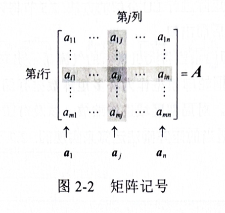
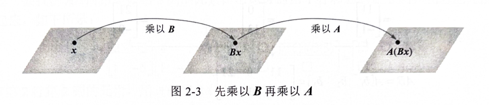
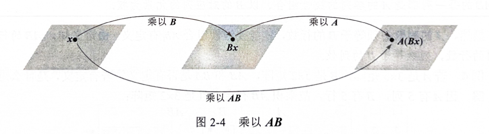
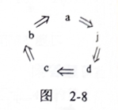
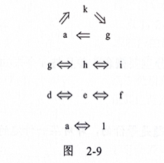
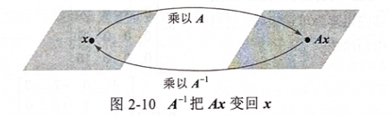
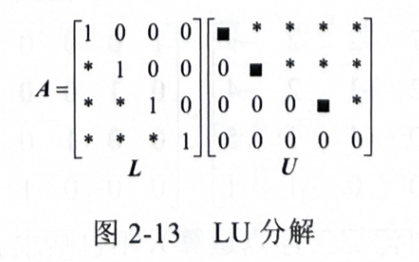
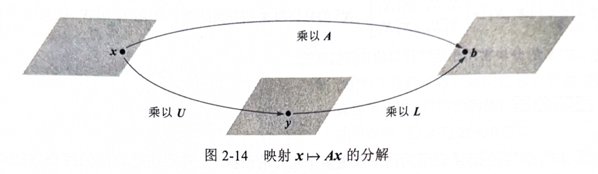
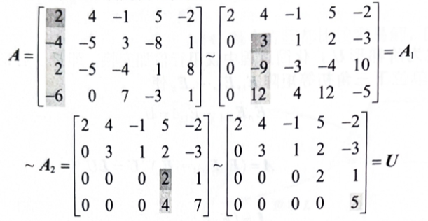
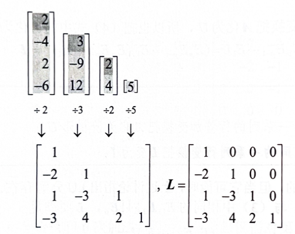

# 第2章 矩阵代数
## 2.1 矩阵运算
若$A$是$m\times n$矩阵，即有$m$行$n$列的矩阵，则$A$的第$i$行$j$列元素记作$a_{ij}$，称为$A$的$(i,j)$元素，见图2.2。$A$的各列是$\mathbb{R}^m$中的向量，用黑体字母$\bold {a_1, a_2, \cdots, a_n}$表示，写作$\bold {A=[a_1, a_2, \cdots, a_n]}$，注意$a_{ij}$是第$j$个列向量$a_j$的第$i$个元素。
$m\times n$矩阵$A=[a_{ij}]$的**对角线元素**是$a_{11}, a_{22}, \cdots, a_{mm}$，它们组成$A$的**主对角线**。**对角矩阵**是一个方阵，它的非对角线元素全是0，例如$n \times n$单位矩阵$I_n$。元素全是零的$m \times n$矩阵称为**零矩阵**，用0表示。零矩阵的维数通常可由上下文知道，否则我们就用$\bold {0_{m\times n}}$表示。

### 和与标量乘法
前面叙述过的向量运算可以自然地推广到矩阵运算。我们称两个矩阵相等，若它们有相同的维数（即有相同的行数和列数），且对应位置上的元素都相等。若$A$和$B$是两个$m \times n$矩阵，则和$A+B$也是一个$m \times n$矩阵，它的各列是$A$和$B$对应列的和。因列的向量加法是对应元素相加，故$A+B$的每个元素也就是$A$和$B$对应元素相加。仅当$A$和$B$的维数相同时，$A+B$才定义。
**定理 1 设$A$, $B$, $C$**是相同维数的矩阵，$r$和$s$是实数，则有：
$$
\begin{align*}
&A + B = B + A\\
&(A + B) + C = A + (B + C)\\
&A + 0 = A\\
&r(A + B) = rA + rB\\
&(r+s)A = rA + sA\\
&r(sA) = (rs)A\\
\end{align*}
$$

### 矩阵乘法
当矩阵$B$乘以向量$x$，它将$x$变换为向量$Bx$。若这个向量又乘以矩阵$A$，则得到的向量是$A(Bx)$，见图2-3。

于是$A(Bx)$是由$x$经复合映射变换所得，此映射是1.8节所研究的线性变换。我们的目的是将此复合映射表示为乘以一个矩阵的变换，此矩阵记为$AB$，即：
$$
A(Bx) = (AB)x
$$
见图2-4:

若$A$是$m \times n$矩阵，$B$是$n \times p$矩阵，$x$属于$\mathbb{R}^p$，用$b_1, b_2, \cdots, b_p$表示$B$的各列，而$x$的元素为$x_1, x_2, \cdots, x_p$，则：
$$
Bx = x_1b_1 + x_2b_2 + \cdots + x_pb_p
$$
由乘以$A$的线性性质，我们有：
$$
A(Bx) = A(x_1b_1) + A(x_2b_2) + \cdots + A(x_pb_p) = x_1Ab_1 + x_2Ab_2 + \cdots + x_pAb_p
$$
向量$A(Bx)$是向量$Ab_1, Ab_2, \cdots, Ab_p$的线性组合，以$x$的元素为权。若我们把这些量表示成一个矩阵的各列，就有：
$$
A(Bx) = [Ab_1, Ab_2, \cdots, Ab_p]x
$$
于是乘以矩阵$[Ab_1, Ab_2, \cdots, Ab_p]$把向量$x$变换为向量$A(Bx)$，这便找到了所需要的矩阵。
定义 若$A$是$m \times n$矩阵，$B$是$n \times p$矩阵，$B$的列是$\bold {b_1, b_2, \cdots, b_p}$，则乘积$AB$是$m \times p$矩阵，它的各列是$\bold {A(b_1), A(b_2), \cdots, A(b_p)}$，即：
$$
AB = A[b_1, b_2, \cdots, b_p] = [A(b_1), A(b_2), \cdots, A(b_p)]
$$
这个定义使（1）式对$\mathbb{R}^p$中的任意向量$x$成立。方程（1）证明图2-4中的复合映射是线性变换，它的标准矩阵是$AB$。矩阵乘法对应于线性变换的复合。
注意，由$AB$的定义，它的第一列$Ab_1$是由$A$的各列用$b_1$的各元素为权的线性组合，其它各列也是这样。
$AB$的每一列都是$A$的各列的线性组合，以$B$的对应列的元素为权。
显然，$A$的列数必须等于$B$的行数，才能使线性组合$Ab_1$有定义。由定义知，$AB$的行数等于$A$的行数，列数等于$B$的列数。
$AB$的定义对理论与应用是重要的，但下列法则给出了更有效的计算$AB$的各元素的方法：
**计算$AB$的行列法则**
若乘积$AB$有定义，则$AB$的第$i$行第$j$列元素是$A$的第$i$行各元素与$B$的第$j$列对应元素的乘积之和。若$(AB)_ij$是$AB$的第$i$行第$j$列元素，$A$为$m \times n$矩阵，则：
$$
(AB)_{ij} = a_{i1}b_{1j} + a_{i2}b_{2j} + \cdots + a_{in}b_{nj}
$$
为证明这一法则，设$B=[b_1, b_2, \cdots, b_p]$，$AB$的第$j$列是$Ab_j$，我们可用1.4节的计算$Ax$的行向量法则计算$Ab_j$。$Ab_j$的第$i$个元素是$A$的第$i$行各元素与向量$b_j$对应元素的之积，这恰好是上述规则中计算$AB$的第$i$行第$j$列元素的方法。

### 矩阵乘法的性质
下列定理列出了矩阵乘法的重要性质，其中$I_m$是$m \times m$单位矩阵，对$\mathbb{R}^m$中的一切向量$x$，$I_mx=x$。
**定理 2 设$A$为$m \times n$矩阵，$B$和$C$的维数使下列各式的乘积有定义：
$$
\begin{align*}
&A(BC) = (AB)C\\
&A(B+C) = AB + AC\\
&(B+C)A = BA + CA\\
&r(AB) = (rA)B = A(rB)\\
&I_mA = A = AI_n
\end{align*}
$$
**警告**
1. 一般情况下，$AB \neq BA$。
2. 消去律对矩阵乘法不成立，即若$AB=BC$，一般情况下，$B=C$并不成立。
3. 若乘积$AB$是零矩阵，一般情况下，不能断定$A=0$或$B=0$。

### 矩阵的乘幂
若$A$是$n \times n$矩阵，$k$是正整数，则$A^k$表示$k$个$A$相乘：
$$
A^k = \underbrace{A \times A \times \cdots \times A}_{k个}
$$
若$A$不是零矩阵，且$x$属于$\mathbb{R}^n$，则$A^kx$表示$x$被$A$连续左乘$k$次。若$k=0$，则$A^0x$就是$x$本身。因此$A^0$被解释为单位矩阵。

### 矩阵的转置
给定一个$m \times n$矩阵$A$，则$A$的转置$A^T$是一个$n \times m$矩阵。
定理3 设$A$与$B$表示矩阵，其维数使下列和与积有定义，则：
$$
\begin{align*}
&(A^T)^T = A\\
&(A+B)^T = A^T + B^T\\
&\text{对任意数}r, (rA)^T = rA^T\\
&(AB)^T = B^TA^T
\end{align*}
$$

矩阵的乘积的转置等于它们的转置的乘积，但相乘的顺序相反。

## 2.2 矩阵的逆
&emsp;&emsp;矩阵代数提供了对矩阵方程进行运算的工具以及许多与普通的实数代数相似的有用公式。本节研究矩阵中与非零数的倒数（即乘法逆）类似的问题。
&emsp;&emsp;回顾实数5的乘法逆是$5^{-1}$，它满足方程：
$$
5^{-1} \times 5 = 1\qquad \text{和} \qquad 5 \times 5^{-1} = 1
$$
矩阵对逆的一般化也要求两个方程同时成立，因为矩阵乘法不是可交换的。进一步，完全的一般化是可能的，仅当有关矩阵是方阵。
&emsp;&emsp;一个$n \times n$矩阵$A$是可逆的，若存在一个$n \times n$矩阵$C$，使：
$$
A \times C = C \times A = I_n
$$
其中$I_n$是$n \times n$单位矩阵。$C$称为$A$的逆，记作$A^{-1}$，$C$由$A$唯一确定。
不可逆矩阵有时称为**奇异矩阵**，而可逆矩阵称为**非奇异矩阵**。

### 定理 4 设$A=\begin{bmatrix}a & b\\c & d\end{bmatrix}$，若$ad-bc \neq 0$，则$A$是可逆的，且:
$$
A^{-1} = \frac{1}{ad-bc} \begin{bmatrix}d & -b\\-c & a\end{bmatrix}
$$
若$ad-bc = 0$，则$A$是不可逆，$det A = ad - bc$称为$A$的行列式。

### 定理 5 若$A$是可逆$n \times n$矩阵，则对$\mathbb{R}^n$中的每一个$b$，方程$Ax=b$有唯一解$x=A^{-1}b$。

### 定理 6
a. 若$A$是可逆矩阵，则$A^{-1}$也可逆而且$(A^{-1})^{-1} = A$。
b. 若$A$和$B$都是$n \times n$可逆矩阵，则$AB$也是可逆的，且$(AB)^{-1} = B^{-1}A^{-1}$。
c. 若$A$可逆，则$A^T$也是可逆的，且$(A^T)^{-1} = (A^{-1})^T$。
定理6b的下列推广以后要用到：
若干个$n \times n$可逆矩阵的乘积也是可逆的，其逆等于这些矩阵的逆按相反顺序的乘积。
&emsp;&emsp;在可逆矩阵与矩阵的行变换之间有一种重要的联系，它引出了计算逆矩阵的一种方法。可以看到，可逆矩阵行等价于单位矩阵，而我们可通过观察$A$行化简为$I$这一过程求出$A^{-1}$。

### 初等矩阵
&emsp;&emsp;把单位矩阵进行一次初等变换，就得到初等矩阵

**若对$m \times n$矩阵$A$进行某种初等行变换，所得矩阵可写成$EA$，其中$E$是$m \times m$矩阵，是由$I_m$进行同一行变换所得。**
&emsp;&emsp;因为行变换是可逆的，如在1.1节所示，故初等矩阵也是可逆的。若$E$是由$I$进行行变换所得，则有同一类型的另一行变换把$E$变回$I$。因此，有初等矩阵$F$使$FE=I$。因为$E$和$F$对应于互逆的变换，所以也有$EF=I$。
**每个初等矩阵$E$是可逆的，$E$的逆是一个同类型的初等矩阵，它把$E$变回$I$。**

### 定理 7
$n \times n$矩阵$A$是可逆的，当且仅当$A$的等价于$I_n$，这时把$A$化简为$I_n$的一系列初等行变换同时把$I_n$变成$A^{-1}$。
**注**：  
第1章中关于定理11的证明的注释"$P$ 当且仅当 $Q$"等价于两个语句："若 $P$ 则 $Q$"和"若 $Q$ 则 $P$"。第二个语句称为第一个语句的逆，并解释了本证明第二段中的词语"反之"。

**证明**：  
1. **必要性**（$A$ 可逆 $\Rightarrow A \sim I_n$）：  
   设 $A$ 是可逆矩阵，则对任意 $b$，方程 $Ax = b$ 有解（定理5）。由1.4节定理4，$A$ 在每一行有一个主元位置。因 $A$ 是方阵，这 $n$ 个主元必在对角线上，故 $A$ 的简化阶梯形是 $I_n$，即 $A \sim I_n$。

2. **充分性**（$A \sim I_n \Rightarrow A$ 可逆）：  
   若 $A \sim I_n$，则存在初等矩阵 $E_1, E_2, \cdots, E_p$ 使得：
   $$
   E_p E_{p-1} \cdots E_1 A = I_n \tag{1}
   $$
   因为 $E_p E_{p-1} \cdots E_1$ 是可逆矩阵的乘积，故可逆。由(1)式可得：
   $$
   A = (E_p E_{p-1} \cdots E_1)^{-1}
   $$
   因此 $A$ 是可逆的（定理6）。进一步有：
   $$
   A^{-1} = E_p E_{p-1} \cdots E_1
   $$
   这表明 $A^{-1}$ 可通过将 $I_n$ 依次用 $E_1, E_2, \cdots, E_p$ 作用得到，即对 $I_n$ 施加与 $A \rightarrow I_n$ 相同的行变换序列。

**求$A^{-1}$的算法**
&emsp;&emsp;若我们把$A$和$I$放在一起构成增广矩阵$[A \;I]$，则对此矩阵进行行行变换时，$A$和$I$受到同一变换。由定理7，要么有一系列的行变换把$A$变成$I$，同时把$I$变成$A^{-1}$，要么$A$是不可逆的。

**把增广矩阵$[A \; I]$进行化简，若$A$行等价于$I$，则$[A \; I]$行等价于$[I \; A^{-1}]$，否则$A$没有逆。**

### 有关逆矩阵的另一个观点
&emsp;&emsp;用$e_1, e_2, \cdots, e_n$表示$I_n$的各列，则把$[A \; I]$化简为$[I \; A^{-1}]$的过程可看作解$n$个方程组：
$$
Ax = e_1, Ax = e_2, \cdots, Ax = e_n \qquad (2)
$$
将这些方程的”增广列“都放在$A$的右边，构成矩阵：
$$
[A \; e_1 \; e_2 \; \cdots \; e_n] = [A \; I]
$$
等式$AA^{-1} = I$及矩阵乘法的定义说明$A^{-1}$的列正好是方程组（2）的解。这一点是很有用的，因为在某些问题中，只需要$A^{-1}$的一列或二列。这时只需要解（2）中的相应方程即可。

## 2.3 可逆矩阵的特征
本节复习第 1 章引入的大部分重要概念，并且与 \( n \) 个未知量 \( n \) 个方程的方程组以及方阵联系起来，主要结论是定理8。

### 定理 8（可逆矩阵定理）

设 \( A \) 为 \( n \times n \) 矩阵，则下列命题是等价的，即对某一特定的 \( A \)，它们同时为真或同时为假。

a. \( A \) 是可逆矩阵。  
b. \( A \) 行等价于 \( n \times n \) 单位矩阵。  
c. \( A \) 有 \( n \) 个主元位置。  
d. 方程 \( A\mathbf{x} = \mathbf{0} \) 仅有平凡解。  
e. \( A \) 的各列线性无关。  
f. 线性变换 \( \mathbf{x} \mapsto A\mathbf{x} \) 是一对一的。  
g. 对 \( \mathbb{R}^n \) 中任意 \( \mathbf{b} \)，方程 \( A\mathbf{x} = \mathbf{b} \) 至少有一个解。  
h. \( A \) 的各列生成 \( \mathbb{R}^n \)。  
i. 线性变换 \( \mathbf{x} \mapsto A\mathbf{x} \) 把 \( \mathbb{R}^n \) 映射到 \( \mathbb{R}^n \) 上。
j. 存在 \( n \times n \) 矩阵 \( C \) 使 \( CA = I \)。  
k. 存在 \( n \times n \) 矩阵 \( D \) 使 \( AD = I \)。  
l. \( A^T \) 是可逆矩阵。  
&emsp;&emsp;首先，我们需要某些记号。若命题 a 为真蕴涵命题 j 也真，则称 a 蕴涵 j，记为 \( a \Rightarrow j \)。我们将按图 2-8 中蕴涵的“循环”来证明这些命题的等价性，即这五个命题之一为真可推出其他命题也真，然后把其他命题链接进这个循环。

**证明**  
&emsp;&emsp;若 a 为真，则 \( A^{-1} \) 可作为 j 中的 \( C \)，故 \( a \Rightarrow j \)。其次，由 2.1 节习题 31（请参阅该习题），\( j \Rightarrow d \)。又由 2.2 节习题 33 可知 \( d \Rightarrow c \)。若 \( A \) 是方阵且有 \( n \) 个主元位置，则主元必定在主对角线上，在这种情况下，\( A \) 的简化阶梯形是 \( I_n \)，因此 \( c \Rightarrow b \)。同时由 2.2 节定理 7 知 \( b \Rightarrow a \)。至此完成图 2-8 中的证明循环。

&emsp;&emsp;其次，由于 \( A^{-1} \) 可作为 \( D \)，故 \( a \Rightarrow k \)。又由 2.1 节习题 32 知 \( k \Rightarrow g \)，而由 2.2 节习题 34 有 \( g \Rightarrow a \)，因此 \( g \) 和 \( k \) 被链接进这个循环。再根据 1.4 节定理 4 和 1.9 节定理 12a，对任一矩阵来说，\( g \)、\( h \) 和 \( i \) 是等价的。因此，通过 \( g \) 使 \( h \) 和 \( i \) 被链接进这个循环。

&emsp;&emsp;因 \( d \)、\( e \)、\( f \) 对任一矩阵 \( A \) 是等价的（参见 1.7 节及 1.9 节定理 12b），而 \( d \) 在这个循环之中，所以 \( e \) 和 \( f \) 也在这个循环中。最后，由 2.2 节定理 6c 有 \( a \Rightarrow l \)，再根据同一个定理，将 \( A \) 和 \( A^T \) 互换后得到 \( l \Rightarrow a \)。见图 2-9。这就完成了定理 8 的证明。

&emsp;&emsp;由 2.2 节定理 5，定理 8 中命题 \( g \) 也可写成 “方程 \( A\mathbf{x} = \mathbf{b} \) 对任意 \( \mathbb{R}^n \) 中的 \( \mathbf{b} \) 有唯一解”。这个命题当然也蕴涵 \( b \)，因此也蕴涵 \( A \) 为可逆阵。

下列事实由定理8及2.2节习题8推出：
设$A$和$B$为方阵，若$AB=I$，则$A$和$B$都是可逆的，且$B=A^{-1}$, $A=B^{-1}$

可逆矩阵定理将所有 \( n \times n \) 矩阵分为两个不相交集合：  
- **可逆（非奇异）矩阵**  
- **不可逆（奇异）矩阵**  

**可逆矩阵的性质**  
定理中每个命题给出了 \( n \times n \) 可逆矩阵的一个性质。  

**奇异矩阵的性质**  
定理中每个命题的否定形式给出了 \( n \times n \) 奇异矩阵的一个性质。例如：  
- 奇异矩阵**不**行等价于 \( n \times n \) 单位矩阵 \( I_n \)。  
- 奇异矩阵**没有** \( n \) 个主元位置。  
- 奇异矩阵的各列**线性相关**。  

其他性质在习题中进一步讨论。  

### 可逆矩阵定理的作用

可逆矩阵定理建立了多个重要概念之间的联系，例如：  
- 将矩阵 \( A \) 的**列的线性无关性**  
- 与方程 \( A\mathbf{x} = \mathbf{b} \) 的**解的存在性**  
关联起来。  

### 重要限制
**该定理仅适用于方阵**（即 \( n \times n \) 矩阵）。  
- 对于非方阵（如 \( 4 \times 3 \) 矩阵），即使其列线性无关，也不能通过此定理直接推断方程 \( A\mathbf{x} = \mathbf{b} \) 解的存在性或唯一性。  
- 此类情况需借助其他理论（如秩、线性变换性质等）进一步分析。  

### 可逆线性变换

&emsp;&emsp;回忆 2.1 节中矩阵乘法对应于线性变换的复合。当矩阵 \( A \) 可逆时，方程 \( A^{-1}A\mathbf{x} = \mathbf{x} \) 可视为线性变换的一个命题（见图 2-10）。

> **图 2-10**：\( A^{-1} \) 将 \( A\mathbf{x} \) 映射回 \( \mathbf{x} \)。

**定义**  
线性变换 \( T: \mathbb{R}^n \to \mathbb{R}^n \) 称为**可逆的**，若存在函数 \( S: \mathbb{R}^n \to \mathbb{R}^n \) 满足：  
1. 对所有 \( \mathbf{x} \in \mathbb{R}^n \)，\( S(T(\mathbf{x})) = \mathbf{x} \)  (1)  
2. 对所有 \( \mathbf{x} \in \mathbb{R}^n \)，\( T(S(\mathbf{x})) = \mathbf{x} \)  (2)  

**定理 9**  
设 \( T: \mathbb{R}^n \to \mathbb{R}^n \) 为线性变换，\( A \) 为其标准矩阵。则：  
- \( T \) 可逆 **当且仅当** \( A \) 是可逆矩阵。  
- 此时，由 \( S(\mathbf{x}) = A^{-1}\mathbf{x} \) 定义的线性变换 \( S \) 是唯一满足 (1) 和 (2) 的函数，称为 \( T \) 的逆，记作 \( T^{-1} \)。  

**证明**  
1. **必要性**（\( T \) 可逆 \(\Rightarrow\) \( A \) 可逆）：  
   由 (2) 式说明$T$是从$\mathbb{R}^n$映射到$\mathbb{R}^n$上的映射，因若 \( \mathbf{b} \in \mathbb{R}^n \)，$\mathbb{x}=S(\mathbb{b})$，则$T(\mathbf{x})=T(S(\mathbf{b})=\mathbb{b}$，所以每个$\mathbb{b}$属于$T$的值域。于是根据可逆矩阵定理（命题 i），\( A \) 可逆。  

2. **充分性**（\( A \) 可逆 \(\Rightarrow\) \( T \) 可逆）：  
   令 \( S(\mathbf{x}) = A^{-1}\mathbf{x} \)，则 \( S \) 是线性变换，且直接验证：  
   \[
   S(T(\mathbf{x})) = S(A\mathbf{x}) = A^{-1}(A\mathbf{x}) = \mathbf{x}, \quad T(S(\mathbf{x})) = T(A^{-1}\mathbf{x}) = A(A^{-1}\mathbf{x}) = \mathbf{x}.
   \]  
   故 \( T \) 可逆。唯一性证明见习题 47。  

**注**  
- 定理 9 将矩阵可逆性与线性变换可逆性统一起来。  
- 逆变换 \( S \) 的唯一性表明可逆线性变换的逆是唯一的。  

### 数值计算的注解

在实际应用中，可能会遇到以下两类特殊矩阵：

1. **病态矩阵（接近奇异的矩阵）**  
   - 虽然是可逆矩阵，但当其某些元素发生微小扰动时，可能变为奇异矩阵。  
   - 行化简过程中，舍入误差可能导致主元位置少于 \( n \) 个。  

2. **舍入误差的影响**  
   - 数值计算中的舍入误差可能使**奇异矩阵**在计算中表现为可逆矩阵。  

#### 条件数的作用  
- **定义**：矩阵程序通过计算**条件数**来评估矩阵的数值稳定性。  
  - 条件数越大，矩阵越接近奇异。  
  - 单位矩阵 \( I \) 的条件数为 **1**（最稳定）。  
  - 奇异矩阵的条件数为 **无穷大**。  
- **局限性**：在极端情况下，数值程序可能无法区分**严格奇异矩阵**和**病态矩阵**。  

#### 潜在问题  
- 如习题49-53所示，**高条件数**的矩阵在计算中可能导致显著误差（如解的不稳定性或错误结果）。 

## 2.4 分块矩阵

&emsp;&emsp;我们可以把矩阵看作一组列向量，而非仅仅是一个数的矩形表。这种观点非常有用，因此，我们希望考虑 \( A \) 的其他分块，把它用水平线和竖直线分成几块，如下面例1所示。分块矩阵也出现在线性代数的现代应用中，因为这些记号简化了许多讨论，并使矩阵分析中许多本质的结构显露出来，如本章关于飞机设计的介绍性示例所示。本节提供一个复习矩阵代数和使用可逆矩阵定理的机会。

**例 1** 矩阵  

$
A = \begin{bmatrix}
3 & 0 & -1 & \mid & 5 & 9 &\mid & -2 \\
-5 & 2 & 4 & \mid & 0 & -3 &\mid & 1 \\
\hline -8 & -6 & 3 & \mid & 1 & 7 &\mid &-4
\end{bmatrix}
$  

也可写成 \(2 \times 3\) 分块矩阵  

\[
A = \begin{bmatrix}
A_{11} & A_{12} & A_{13} \\
A_{21} & A_{22} & A_{23}
\end{bmatrix}
\]  

它的元素是分块（或子矩阵）  

\[
A_{11} = \begin{bmatrix}
3 & 0 & -1 \\
-5 & 2 & 4 
\end{bmatrix}, \quad 
A_{12} = \begin{bmatrix}
5 & 9 \\
0 & -3
\end{bmatrix}, \quad 
A_{13} = \begin{bmatrix}
-2 \\
1
\end{bmatrix}
\]  

\[
A_{21} = \begin{bmatrix} -8 & -6 & 3 \end{bmatrix}, \quad 
A_{22} = \begin{bmatrix} 1 & 7 \end{bmatrix}, \quad 
A_{23} = \begin{bmatrix} -4 \end{bmatrix}
\]  

### 加法与标量乘法

&emsp;&emsp;若矩阵 \( A \) 与 \( B \) 有相同维数且以同样方式分块，则自然有矩阵的和 \( A + B \) 也以同样方式分块。这时 \( A + B \) 的每一块恰好是 \( A \) 和 \( B \) 对应分块的（矩阵）和。分块矩阵乘以一个数也可以逐块计算。

### 分块矩阵的乘法

&emsp;&emsp;分块矩阵也可用通常的行列法则进行乘法运算，就如每一块都是数一样。对于乘积 \( AB \)，只要 \( A \) 的列的分法与 \( B \) 的行的分法一致。

**例 3**

设分块矩阵：

$A = \begin{bmatrix} 2 & -3 & 1 &\mid & 0 & -4 \\ 1 & 5 & -2 &\mid & 3 & -1 \\ \hline 0 & -4 & -2 &\mid & 7 & -1 \end{bmatrix} = \begin{bmatrix} A_{11} & A_{12} \\ A_{21} & A_{22} \end{bmatrix}$

其中：
$A_{11} = \begin{bmatrix} 2 & -3 & 1 \\ 1 & 5 & -2 \end{bmatrix}$, 
$A_{12} = \begin{bmatrix} 0 & -4 \\ 3 & -1 \end{bmatrix}$,
$A_{21} = \begin{bmatrix} 0 & -4 & -2 \end{bmatrix}$,
$A_{22} = \begin{bmatrix} 7 & -1 \end{bmatrix}$

$B = \begin{bmatrix} 6 & 4 \\ -2 & 1 \\ -3 & 7 \\ \hline -1 & 3 \\ 5 & 2 \end{bmatrix} = \begin{bmatrix} B_1 \\ B_2 \end{bmatrix}$

其中：
$B_1 = \begin{bmatrix} 6 & 4 \\ -2 & 1 \\ -3 & 7 \end{bmatrix}$,
$B_2 = \begin{bmatrix} -1 & 3 \\ 5 & 2 \end{bmatrix}$

#### 解

矩阵 $A$ 的5列被分成3列和2列两组，$B$ 的5行也按相同方式分块（3行和2行）。乘积 $AB$ 可表示为：

$AB = \begin{bmatrix} A_{11}B_1 + A_{12}B_2 \\ A_{21}B_1 + A_{22}B_2 \end{bmatrix} = \begin{bmatrix} -5 & 4 \\ -6 & 2 \\ \hline 2 & 1 \end{bmatrix}$

#### 计算过程

1. **计算 $A_{11}B_1 + A_{12}B_2$**:
   $A_{11}B_1 = \begin{bmatrix} 2 & -3 & 1 \\ 1 & 5 & -2 \end{bmatrix} \begin{bmatrix} 6 & 4 \\ -2 & 1 \\ -3 & 7 \end{bmatrix} = \begin{bmatrix} 15 & 12 \\ 2 & -5 \end{bmatrix}$
   
   $A_{12}B_2 = \begin{bmatrix} 0 & -4 \\ 3 & -1 \end{bmatrix} \begin{bmatrix} -1 & 3 \\ 5 & 2 \end{bmatrix} = \begin{bmatrix} -20 & -8 \\ -8 & 7 \end{bmatrix}$
   
   $A_{11}B_1 + A_{12}B_2 = \begin{bmatrix} 15 & 12 \\ 2 & -5 \end{bmatrix} + \begin{bmatrix} -20 & -8 \\ -8 & 7 \end{bmatrix} = \begin{bmatrix} -5 & 4 \\ -6 & 2 \end{bmatrix}$

2. **计算 $A_{21}B_1 + A_{22}B_2$**:
   $A_{21}B_1 = \begin{bmatrix} 0 & -4 & -2 \end{bmatrix} \begin{bmatrix} 6 & 4 \\ -2 & 1 \\ -3 & 7 \end{bmatrix} = \begin{bmatrix} 14 & -18 \end{bmatrix}$
   
   $A_{22}B_2 = \begin{bmatrix} 7 & -1 \end{bmatrix} \begin{bmatrix} -1 & 3 \\ 5 & 2 \end{bmatrix} = \begin{bmatrix} -12 & 19 \end{bmatrix}$
   
   $A_{21}B_1 + A_{22}B_2 = \begin{bmatrix} 14 & -18 \end{bmatrix} + \begin{bmatrix} -12 & 19 \end{bmatrix} = \begin{bmatrix} 2 & 1 \end{bmatrix}$

#### 结果

最终乘积矩阵为：
$AB = \begin{bmatrix} -5 & 4 \\ -6 & 2 \\ 2 & 1 \end{bmatrix}$

### 分块矩阵乘法的行列法则

分块矩阵乘法的行列法则给出了两个矩阵乘积的最一般观点。以下是矩阵乘积的几种观点：
1. 使用 $A$ 的列来给出 $Ax$ 的定义
2. $AB$ 的列的定义
3. 计算 $AB$ 的行列法则
4. $A$ 的行与矩阵 $B$ 的乘积作为 $AB$ 的行

下面的定理10应用分块思想给出了 $AB$ 的第5种观点。

**例4**
设 $A = \begin{bmatrix} -3 & 1 & 2 \\ 1 & -4 & 5 \end{bmatrix}$ 和 $B = \begin{bmatrix} a & b \\ c & d \\ e & f \end{bmatrix}$。验证：

$$AB = \text{col}_1(A)\text{row}_1(B) + \text{col}_2(A)\text{row}_2(B) + \text{col}_3(A)\text{row}_3(B)$$

**解**：
每一项都是外积，计算如下：

$$
\text{col}_1(A)\text{row}_1(B) = \begin{bmatrix} -3 \\ 1 \end{bmatrix} \begin{bmatrix} a & b \end{bmatrix} = \begin{bmatrix} -3a & -3b \\ a & b \end{bmatrix}
$$

$$
\text{col}_2(A)\text{row}_2(B) = \begin{bmatrix} 1 \\ -4 \end{bmatrix} \begin{bmatrix} c & d \end{bmatrix} = \begin{bmatrix} c & d \\ -4c & -4d \end{bmatrix}
$$

$$
\text{col}_3(A)\text{row}_3(B) = \begin{bmatrix} 2 \\ 5 \end{bmatrix} \begin{bmatrix} e & f \end{bmatrix} = \begin{bmatrix} 2e & 2f \\ 5e & 5f \end{bmatrix}
$$

于是：

$$
\sum_{k=1}^3 \text{col}_k(A)\text{row}_k(B) = \begin{bmatrix} -3a+c+2e & -3b+d+2f \\ a-4c+5e & b-4d+5f \end{bmatrix} = AB
$$

注意 $AB$ 的每个元素是三个外积对应位置元素之和。

### 定理10 （$AB$ 的列行展开）
若 $A$ 是 $m \times n$ 矩阵，$B$ 是 $n \times p$ 矩阵，则：

$$
AB = [\text{col}_1(A) \quad \text{col}_2(A) \quad \cdots \quad \text{col}_n(A)] \begin{bmatrix} \text{row}_1(B) \\ \text{row}_2(B) \\ \vdots \\ \text{row}_n(B) \end{bmatrix} \tag{1}
$$

$$
= \text{col}_1(A)\text{row}_1(B) + \text{col}_2(A)\text{row}_2(B) + \cdots + \text{col}_n(A)\text{row}_n(B)
$$

**证明**：
对每个行指标 $i$ 和列指标 $j$，乘积 $\text{col}_k(A)\text{row}_k(B)$ 的 $(i,j)$ 元素是 $a_{ik}b_{kj}$。因此在(1)式的和中，$(i,j)$ 元素为：

$$
\begin{align*}
&a_{i1}b_{1j} & &(k = 1)\\
+&a_{i2}b_{2j} & &(k = 2)\\
+&\cdots\\
+&a_{in}b_{nj} & &(k = n)
\end{align*}
$$

根据行列法则，该和恰好是 $AB$ 的 $(i,j)$ 元素。

### 分块矩阵的逆

下例说明分块矩阵的逆的求法。

**例5** &emsp;&emsp;形如 $A = \begin{bmatrix} A_{11} & A_{12} \\ 0 & A_{22} \end{bmatrix}$ 的矩阵称为**分块上三角矩阵**。设 $A_{11}$ 是 $p \times p$ 矩阵，$A_{22}$ 是 $q \times q$ 矩阵，且 $A$ 为可逆矩阵。求 $A^{-1}$ 的表达式。

**解** &emsp;&emsp;用 $B$ 表示 $A^{-1}$ 且分块为 $B = \begin{bmatrix} B_{11} & B_{12} \\ B_{21} & B_{22} \end{bmatrix}$，满足：

$$
\begin{bmatrix} 
A_{11} & A_{12} \\ 
0 & A_{22} 
\end{bmatrix}
\begin{bmatrix} 
B_{11} & B_{12} \\ 
B_{21} & B_{22} 
\end{bmatrix}
= \ 
\begin{bmatrix} 
I_p & 0 \\ 
0 & I_q 
\end{bmatrix}
\quad (2)
$$

展开矩阵乘法，得到方程组：
1. $A_{11}B_{11} + A_{12}B_{21} = I_p \quad (3)$    
2. $A_{11}B_{12} + A_{12}B_{22} = 0 \quad (4)$
3. $A_{22}B_{21} = 0 \quad (5)$
4. $A_{22}B_{22} = I_q \quad (6)$

**求解步骤**：
1. 由 (6) 式、可逆矩阵定理及$A_{22}$是方阵的事实，可以断定 $A_{22}$ 可逆，且 $B_{22} = A_{22}^{-1}$。  
2. 由 (5) 式得 $B_{21} = A_{22}^{-1}0 = 0$。  
3. 将$B_{21} = 0$代入 (3) 式得 $A_{11}B_{11} = I_p$，故 $B_{11} = A_{11}^{-1}$。  
4. 由 (4) 式得 $B_{12} = -A_{11}^{-1}A_{12}A_{22}^{-1}$。  

**最终结果**：
$$
A^{-1} = 
\begin{bmatrix} 
A_{11}^{-1} & -A_{11}^{-1}A_{12}A_{22}^{-1} \\ 
0 & A_{22}^{-1} 
\end{bmatrix}
$$

&emsp;&emsp;**分块对角矩阵**是一个分块矩阵，除主对角块外, 其余全是零分块。可逆的充要条件是主对角块均可逆。

---

### 数值计算的注解

1. **内存管理**：  
   当矩阵过大时，分块处理允许计算机分批次计算子矩阵。例如，某线性规划问题将矩阵分为837行×51列，在Cray超级计算机上耗时约4分钟。

2. **高效运算**：  
   支持向量传输技术的高速计算机对分块矩阵的运算效率更高。

3. **专业软件**：  
   高性能计算库LAPACK广泛使用分块矩阵算法，习题中展示了典型应用场景的计算方法。

## 2.5 矩阵分解
&emsp;&emsp;矩阵 $A$ 的分解是把 $A$ 表示为两个或更多个矩阵的乘积。矩阵乘法是数据的综合（把两个或更多个线性变换的作用结合成一个矩阵），矩阵分解是数据的分解。在计算机科学的语言中，将 $A$ 表示为矩阵的乘积是对 $A$ 中数据的预处理，把这些数据分成两个或更多部分，这种结构可能更有用，或者更便于计算。

### LU分解
下面所述的LU分解在一些工业与商业问题中很常见，用于求解一系列具有相同系数矩阵的线性方程（见习题32）：

$$ Ax = b_1, Ax = b_2, \cdots, Ax = b_p \tag{1} $$

在5.8节中，逆幂法通过这个求解一系列形如（1）中的方程来估计矩阵的特征值。

当 $A$ 可逆时，可计算 $A^{-1}$，然后计算 $A^{-1}b_1$, $A^{-1}b_2$，等等。然而，在实践中，（1）式中第一个方程是由行化简解出的，并同时得出 $A$ 的LU分解，因而（1）式中剩下的方程由LU分解求解。

首先，设 $A$ 是 $m \times n$ 矩阵，它可以行化简为阶梯形而不必行对换（此后，我们将处理一般情形），则 $A$ 可写成形式 $A = LU$，$L$ 是 $m \times m$ 下三角形矩阵，主对角线元素全是1，$U$ 是 $A$ 的一个 $m \times n$ 阶梯形矩阵。例如，见图2-13。这样一个分解称为LU分解，矩阵 $L$ 是可逆的，称为单位下三角形矩阵。

图2-13 LU分解

在研究如何构造 $L$ 和 $U$ 之前，我们将看看它们为什么这么有用。当 $A = LU$ 时，方程 $Ax = b$ 可写成 $L(Ux) = b$。把 $Ux$ 写成 $y$，可以由解下面一对方程来求解 $x$：
$$
Ly = b \\  
Ux = y
\tag{2}
$$

首先解 $Ly = b$ 求得 $y$，然后解 $Ux = y$ 求得 $x$，见图 2-14。每个方程都比较容易解，因 $L$ 和 $U$ 都是三角矩阵。

#### 例1 可以证明

$$
A = \begin{bmatrix}
3 & -7 & -2 & 2 \\
-3 & 5 & 1 & 0 \\
6 & -4 & 0 & -5 \\
-9 & 5 & -5 & 12
\end{bmatrix} = \begin{bmatrix}
1 & 0 & 0 & 0 \\
-1 & 1 & 0 & 0 \\
2 & -5 & 1 & 0 \\
-3 & 8 & 3 & 1
\end{bmatrix} \begin{bmatrix}
3 & -7 & -2 & 2 \\
0 & -2 & -1 & 2 \\
0 & 0 & -1 & 1 \\
0 & 0 & 0 & -1
\end{bmatrix} = LU
$$

应用 $A$ 的LU分解来解 $Ax = b$，其中 $b = \begin{bmatrix} -9 \\ 5 \\ 7 \\ 11 \end{bmatrix}$。

##### 第一步：解 $Ly = b$

仅需6次乘法和6次加法（仅对增广列运算）：

$$
[L \quad b] = \begin{bmatrix}
1 & 0 & 0 & 0 & -9 \\
-1 & 1 & 0 & 0 & 5 \\
2 & -5 & 1 & 0 & 7 \\
-3 & 8 & 3 & 1 & 11
\end{bmatrix} \sim \begin{bmatrix}
1 & 0 & 0 & 0 & -9 \\
0 & 1 & 0 & 0 & -4 \\
0 & 0 & 1 & 0 & 5 \\
0 & 0 & 0 & 1 & 1
\end{bmatrix} = [I \quad y]
$$

##### 第二步：解 $Ux = y$

需要4次除法、6次乘法和6次加法：

$$
[U \quad y] = \begin{bmatrix}
3 & -7 & -2 & 2 & -9 \\
0 & -2 & -1 & 2 & -4 \\
0 & 0 & -1 & 1 & 5 \\
0 & 0 & 0 & -1 & 1
\end{bmatrix} \sim \begin{bmatrix}
1 & 0 & 0 & 0 & 3 \\
0 & 1 & 0 & 0 & 4 \\
0 & 0 & 1 & 0 & -6 \\
0 & 0 & 0 & 1 & -1
\end{bmatrix}, \quad x = \begin{bmatrix} 3 \\ 4 \\ -6 \\ -1 \end{bmatrix}
$$

##### 运算量分析
- LU分解法求解 $x$ 共需28次浮点运算（不包括分解过程）
- 直接对 $[A \quad b]$ 行化简为 $[I \quad x]$ 需62次运算

### LU分解算法
&emsp;&emsp;设 $A$ 可以化为阶梯形 $U$，化简过程中仅用行倍加变换（即把一行的倍数加于它下面的另一行）。这样，存在单位下三角初等矩阵 $E_1, E_2, \cdots, E_p$ 使得：

$$ E_p E_{p-1} \cdots E_1 A = U \tag{3} $$

于是：

$$ A = (E_p E_{p-1} \cdots E_1)^{-1} U = LU $$

其中：

$$ L = (E_p E_{p-1} \cdots E_1)^{-1} \tag{4} $$

可以证明，单位下三角形矩阵的乘积和逆也是单位下三角形矩阵（例如见习题19）。因此 $L$ 是单位下三角形矩阵。

**关键观察**：  
(3)式中的行变换将 $A$ 化为 $U$，同时也将 (4)式中的 $L$ 化为 $I$，因为：

$$ E_p E_{p-1} \cdots E_1 L = (E_p E_{p-1} \cdots E_1)(E_p E_{p-1} \cdots E_1)^{-1} = I $$

这一点是构造 $L$ 的关键。

---

### LU分解算法

1. **步骤1**：用一系列行倍加变换将 $A$ 化为阶梯形 $U$（如果可能）
   
2. **步骤2**：构造 $L$ 使其满足：用相同的行变换序列可将 $L$ 变为 $I$

**注**：  
- 当步骤1可行时，LU分解存在
- 根据 (3) 式中的 $E_1, E_2, \cdots, E_p$，$L$ 需满足：

  $$ (E_p E_{p-1} \cdots E_1) L = I $$

- 由可逆矩阵定理，$L$ 可逆且 $(E_p E_{p-1} \cdots E_1) = L^{-1}$
- 从 (3) 式可得 $L^{-1} A = U$，即 $A = LU$，因此步骤2可求出所需的 $L$

#### 例2：矩阵的LU分解

求下列矩阵的LU分解：

$$
A = \begin{bmatrix}
2 & 4 & -1 & 5 & -2 \\
-4 & -5 & 3 & -8 & 1 \\
2 & -5 & -4 & 1 & 8 \\
-6 & 0 & 7 & -3 & 1
\end{bmatrix}
$$

##### 第一步：构造L矩阵初态
$L$ 是4×4单位下三角矩阵，其第一列由$A$的第一列除以第一行主元2得到：

$$
L = \begin{bmatrix}
1 & 0 & 0 & 0 \\
-2 & 1 & 0 & 0 \\
1 & \ast & 1 & 0 \\
-3 & \ast & \ast & 1
\end{bmatrix}
$$

比较 $A$ 和 $L$ 的第一列。把 $A$ 的第一列的后三个元素变成 0 的行变换同时也将 $L$ 的第一列的后三个元素变成 0，同样的道理对 $L$ 的其他各列也是成立的，让我们看一下 $A$ 行化简为阶梯形 $U$ 的过程。也就是说，每个矩阵中标出的元素用于确定把 $A$ 变成 $U$ 的行变换顺序。

上图中标出的元素确定了将 $A$ 化为 $U$ 的行化简。在每个主元列，把标出的元素除以主元后将结果放入 $L$：

容易证明，所求出的$L$和$U$满足$LU = A$。

--

### 实际应用说明
1. **行对换处理**：
   - 实际计算中常使用部分主元法（选择列中绝对值最大的元素作为主元）
   - 此时$L$变为置换下三角矩阵（通过行置换可化为单位下三角矩阵）

2. **方程求解**：
   即使引入行对换，仍可通过类似步骤解$Ax=b$：
   - 按$L$的主元顺序从左到右化简$[L \quad b] \rightarrow [I \quad y]$
   - 再解$Ux = y$

> 注：详细理论可参考相关线性代数教材的"LU分解"章节。

**数值计算的注解**  
下列运算次数的计算适用于 $n \times n$ 稠密矩阵 $A$（大部分元素非零），$n$ 相当大，例如 $n \geq 30$。

1. 计算 $A$ 的 LU 分解大约需要 $2n^3/3$ 次浮算（大约与把 $[A \ b]$ 行化简的次数相同），而求 $A^{-1}$ 大约需要 $2n^3$ 次浮算。

2. 解 $Ly = b$ 和 $Ux = y$ 大约需要 $2n^2$ 次浮算，因任意 $n \times n$ 三角方程组可以用大约 $n^2$ 次浮算解出。

3. 把 $b$ 乘以 $A^{-1}$ 也需要 $2n^2$ 次浮算，但结果可能不如由 $L$ 和 $U$ 得出的精确（由于计算 $A^{-1}$ 及 $A^{-1}b$ 的舍入误差）。

4. 若 $A$ 是稀疏矩阵（大部分元素为 0），则 $L$ 和 $U$ 可能也是稀疏的，然而 $A^{-1}$ 很可能是稠密的。这时，用 LU 分解来解方程 $Ax = b$ 很可能比用 $A^{-1}$ 快很多，见习题31。