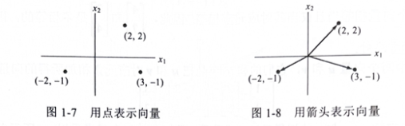
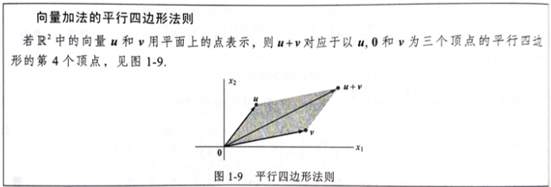

# 线性代数中的线性方程组

## 1.1 线性方程组
- 定义：形如$a_{1}x_{1}+a_{2}x_{2}+...+a_{n}x_{n}=b$
- 解的情况：
  - 无解（不相容）
  - 唯一解
  - 无穷解（相容）

### 初等行变换
1. 倍加变换
2. 对换变换
3. 倍乘变换

### 重要定理
- 增广矩阵行等价⇒解集相同

### 基本问题
1. 相容性判断
2. 解的唯一性判断

### 示例
- 典型线性方程组
  $$
  \begin{cases}
  2x + y = 4 \\
  x - y = 1
  \end{cases}
$$
## 行化简与阶梯形矩阵
### 阶梯形矩阵特征
1. 非零行在零行之上
2. 先导元素右移
3. 下方元素清零

### 简化阶梯形
- 先导元素为1
- 列唯一非零元素

### 重要概念
- 主元位置
  - 简化阶梯形中先导元素1的位置
- 基本变量
  - 对应主元列的变量
- 自由变量
  - 非主元列对应的变量

### 行化简算法步骤
1. 确定主元列
2. 选取主元
3. 下方清零
4. 递归处理子矩阵
5. 上方清零并标准化

### 解的表示
- 通解
  - 用自由变量表示基本变量
- 参数表示
  - 解集的参数方程形式
- 典型阶梯形矩阵示例
  $$
  \begin{bmatrix}
  1 & 0 & -5 & 1 \\
  0 & 1 & 1 & 4 \\
  0 & 0 & 0 & 0
  \end{bmatrix}
$$
- 解的参数方程形式
  $$
  \begin{cases}
  x_1 = 1 + 5x_3 \\
  x_2 = 4 - x_3 \\
  x_3 \text{是自由变量}
  \end{cases}
  $$
## 重要定理
### 存在性与唯一性定理
- 增广矩阵最右列非主元列时相容
- 无自由变量→唯一解
- 有自由变量→无穷解

## 向量方程
### $\mathbb{R}^n$向量空间
- 向量运算规则
  - 加法交换律
  - 标量乘法分配律

### 线性组合
- 定义：$c_1v_1+...+c_pv_p$
- 解集等价性

### 张成空间
- 几何解释：
  - Span{v}：直线
  - Span{u,v}：平面




## 应用示例
```math
\begin{cases}
2x + y = 4 \\
x - y = 1
\end{cases}
```
- 增广矩阵化简过程
- 通解参数表示

